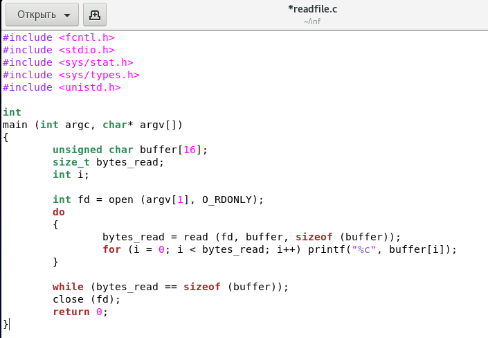

---
# Front matter
title: "Лабораторная работа №5."
subtitle: "Дискреционное разграничение прав в Linux. Исследование влияния дополнительных атрибутов"
author: "Силкина Мария Александровна"

# Formatting
toc-title: "Содержание"
toc: true # Table of contents
toc_depth: 2
lof: true # List of figures
lot: true # List of tables
fontsize: 12pt
linestretch: 1.5
papersize: a4paper
documentclass: scrreprt
polyglossia-lang: russian
polyglossia-otherlangs: english
mainfont: PT Serif
romanfont: PT Serif
sansfont: PT Sans
monofont: PT Mono
mainfontoptions: Ligatures=TeX
romanfontoptions: Ligatures=TeX
sansfontoptions: Ligatures=TeX,Scale=MatchLowercase
monofontoptions: Scale=MatchLowercase
indent: true
pdf-engine: lualatex
header-includes:
  - \linepenalty=10 # the penalty added to the badness of each line within a paragraph (no associated penalty node) Increasing the value makes tex try to have fewer lines in the paragraph.
  - \interlinepenalty=0 # value of the penalty (node) added after each line of a paragraph.
  - \hyphenpenalty=50 # the penalty for line breaking at an automatically inserted hyphen
  - \exhyphenpenalty=50 # the penalty for line breaking at an explicit hyphen
  - \binoppenalty=700 # the penalty for breaking a line at a binary operator
  - \relpenalty=500 # the penalty for breaking a line at a relation
  - \clubpenalty=150 # extra penalty for breaking after first line of a paragraph
  - \widowpenalty=150 # extra penalty for breaking before last line of a paragraph
  - \displaywidowpenalty=50 # extra penalty for breaking before last line before a display math
  - \brokenpenalty=100 # extra penalty for page breaking after a hyphenated line
  - \predisplaypenalty=10000 # penalty for breaking before a display
  - \postdisplaypenalty=0 # penalty for breaking after a display
  - \floatingpenalty = 20000 # penalty for splitting an insertion (can only be split footnote in standard LaTeX)
  - \raggedbottom # or \flushbottom
  - \usepackage{float} # keep figures where there are in the text
  - \floatplacement{figure}{H} # keep figures where there are in the text
---

# Цель работы

Изучение механизмов изменения идентификаторов, применения SetUID- и Sticky-битов. Получение практических навыков работы в консоли с дополнительными атрибутами. Рассмотрение работы механизма смены идентификатора процессов пользователей, а также влияние бита Sticky на запись и удаление файлов.

# Задачи

1. Выполнить лабораторную работу согласно заданному порядку.

2. Ознакомится с применением SetUID- и Sticky-битов, изучение их влияния.

# Выполнение лабораторной работы 

## Подготовка лабораторного стенда 

Первый шаг заключался в установке компилятора gcc для дальнейшего выполнения лабораторной работы, а также отключении системы запретов (рис 1. -@fig:001) (рис 2. -@fig:002).

{ #fig:001 width=70% }

{ #fig:002 width=70% }

## Создание программ

Я зашла в систему от имени пользователя guest, создала файл simpleid.c (рис 3. -@fig:003)

{ #fig:003 width=70% }

Записала в файл simpleid.c требуемый код (рис 4. -@fig:004)

{ #fig:004 width=70% }

Скомпилировала файл simpleid.c (рис 5. -@fig:005)

{ #fig:005 width=70% }

Запустила программу simpleid и системную программу id для сравнения полученных результатов, выведенна информация была идентичной (рис 6. -@fig:006)

{ #fig:006 width=70% }

Далее я создала второй файл программы simpleid2.c (рис 7. -@fig:007)

{ #fig:007 width=70% }

Записала в нее код из инструкции к лабораторной работе, он сложнее нежели прошлый, так как в него добавился вывод действительных идентификаторов (рис 8. -@fig:008)

{ #fig:008 width=70% }

Скомпилировала и запустила данный файл. Вывод оказался аналогичен выводу предыдущей программы (рис 9. -@fig:009)

{ #fig:009 width=70% }

От имени суперпользователя выполнила команды: для изенения владельца программы и права, с которыми пользователь может выполнить файл только с разрешением владельца (рис 10. -@fig:010)

{ #fig:010 width=70% }

Запустила simpleid2 и системную программу id для сравнения полученных результатов, выведенная информация отличалась в одном пункте. Проделала тоже самое относительно SetGID-бита (рис 11. -@fig:011)

{ #fig:011 width=70% }

Создала новый файл readfile.c и ззаписала в него код из инструкции, скомпилировала ее (рис 12. -@fig:012) (рис 13. -@fig:013) 

{ #fig:012 width=70% }

{ #fig:013 width=70% }

Сменила владельца файла и изменила права так, чтобы только суперпользователь
(root) мог прочитать его, a guest не мог и сделала проверку (рис 14. -@fig:014) (рис 15. -@fig:015) (рис 16. -@fig:016)

{ #fig:014 width=70% }

{ #fig:015 width=70% }

{ #fig:016 width=70% }

Установила SetUID-бит и проверила (рис 17. -@fig:017) (рис 18. -@fig:018)

{ #fig:017 width=70% }

{ #fig:018 width=70% }

## Исследование Sticky-бита

Для начала я выяснила установлен ли атрибут Sticky на директории /tmp. Атрибут установлен и обозначается "t". От имени пользователя guest я создала файл, в который записала слово "test", посмотрела атрибуты у файла, установила права для разрешения чтения и записи для категории пользователей "others" и проверила, что они верны (рис 19. -@fig:019)

{ #fig:019 width=70% }

Далее я зашла под пользователем guest2 и попыталась отредактировать дважды данный файл, заменив в нем слово. Данное действие было выполнено успешно. Мне также удавалось проверять содержимое файла, однако удалить файл не получилось (рис 20. -@fig:020)

{ #fig:020 width=70% }

Следующим действием я сняла атрибут Sticky на директории /tmp  от имени суперпользователя. (рис 21. -@fig:021)

{ #fig:021 width=70% }

Дальше я попыталась повторить все ранее проделанные действия от пользователя guest2 и мне удалось перезаписать файл, прочитать и удалить (рис 22. -@fig:022)

{ #fig:022 width=70% }

Повысила права до суперпользователя и вернула атрибут t на директорию (рис 23. -@fig:023)

{ #fig:023 width=70% }

# Выводы

При выполнении данной лабораторной работы я получила практические навыки работы в консоли с дополнительными атрибутами файлов. Я изучила механизмы изменения идентификаторов, применения SetUID- и Sticky-битов. Получение практических навыков работы в консоли с дополнительными атрибутами. Рассмотрела работу механизма смены идентификатора процессов пользователей, а также влияние бита Sticky на запись и удаление файлов.

# Библиография

1. Кулябов Д. С., Королькова А. В., Геворкян М. Н. Информационная безопасность компьютерных сетей. Лабораторная работа № 5. Дискреционное
разграничение прав в Linux. Исследование влияния дополнительных атрибутов.